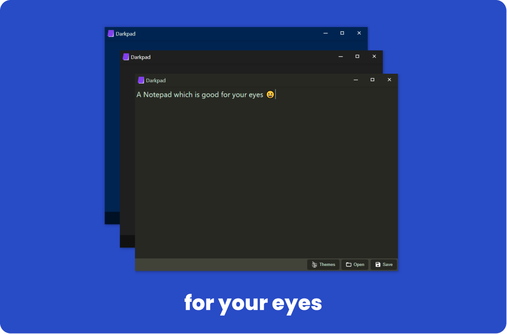

# Darkpad - A Dark Notepad

Notepad hurts your eyes? 😭<br>
I have got you covered.<br><br>


## 🚀 How to get started

```
npm run start:web
```
```
npm run start:desktop
```

## 📦 How to package
* First change MODE to `production` in `electron/main.ts` then run these commands stepwise
```
npm run build:web
npm run build:desktop
npm run package
```

## 🎨 Steps to add new Themes
1. Add your theme in `src/utils/ThemeMap.ts` along with proper hex colors and same name scheme
2. Add your theme in themeMenuItems list in `src/components/TypeArea/TypeArea.tsx`

## Code of conduct
* Fork the Repo
* Clone your forked version
* Create a new branch with appropriate name and checkout in that branch
* Install dependencies using `npm install`
* Make your changes
* Push your code in your forked version
* Send PR with description of your added changes

(In Progress Project)